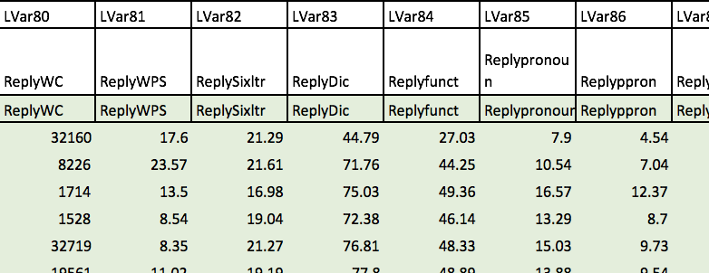
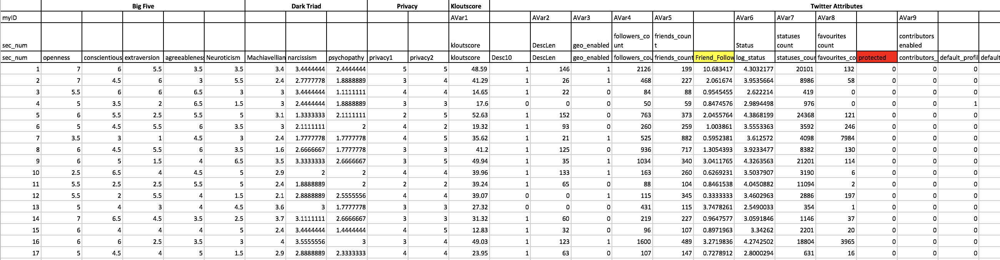

```{r setup, include=FALSE}
knitr::opts_chunk$set(echo = FALSE)
knitr::opts_chunk$set(cache = T)
library(readxl)
library(tidyverse)
library(tidyr)
library(dplyr)
twitter_data <- read_xlsx("./../shiny/twitter_data.xlsx")
 -> temp
```


## Introduction
- Personality  
<!-- `r temp` -->


## Getting the Dataset
- https://www.kaggle.com/c/twitter-personality-prediction  
- Dimensions:  
    - 2930 rows, 587 columns
- Groups of variables
    - Big5, Dark Triad, Twitter Attributes, LIWC, etc. 


## Data Wrangling
Original Variables:

- `r names(twitter_data) %>% head(10)`

Renamed Variables:

- `r twitter_data[3, 1:10]`

## Variables 
Big5

- Openness, Conscientiousness, Extraversion, Agreeableness, Neuroticism

Dark Triad

- Narcissism, Machiavellianism, Psychopathy


## Variables
(Reproducible) Twitter Attributes

- Favourites Count, Followers Count, Friends Count, Statuses, Count

More meaningful, non-reproducible Twitter Attributes

- Kloutscore, Percent Orig Tweets, Percent Retweets, Percent Replies


## Shiny App


## Conclusions
