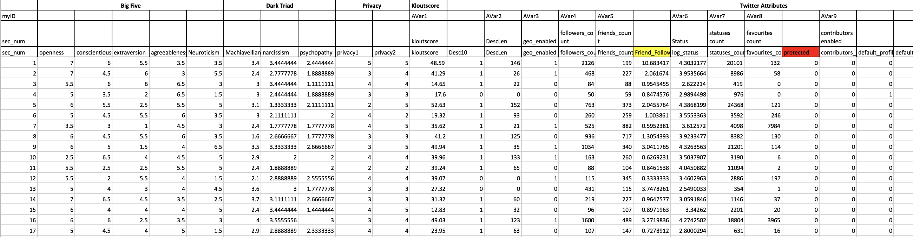

Personality + Twitter Presence: Exploration and Prediction
========================================================
author: Margaret Chien, Amber Liu, Daniel Njoo
date: 12th December 2017
autosize: true
incremental: true


Outline 
========================================================
- Why

- The theory behind personality, and the scales we used

- The data

- Clustering and predictions


Personality + Online Presence?
========================================================
- Facebook, Instagram, LinkedIn, Twitter

- Barrons: 60% of firms wouldn't hire a candidate if they couldn't find any online presence

- So what does our online presence say about us?


Psychometric Theory
========================================================
- 

Psychometric Theory 
========================================================
What firms do
- 

Psychometric Theory
========================================================
Our approach
- 


Big5
========================================================
- psycholexical approach
- reproducible across cultures/languages
- emerged out of statistical analysis of natural language, not armchair theorizing
- the measures (OCEAN):
    - Openness
    - Conscientiousness
    - Extraversion
    - Agreeableness
    - Neuroticism


Dark Triad
========================================================
- Narcissism
- Machiavellianism
- Psychopathy

- Example question: On a scale of 1-5 (disagree to agree), "Do you like to use clever manipulation to get your way?"

Getting the Dataset
========================================================

Kaggle competition: predicting psychopathy from Twitter usage?

- https://www.kaggle.com/c/twitter-personality-prediction 

- hosted by the Online Privacy Foundation

- 5 years ago, top score 86%

Couldn't get explanation of the variables, nor reproduce many of them (e.g. LIWC)

- 


The Dataset
========================================================

Dimensions:  

- 2930 rows, 587 columns

Groups of variables

- Big5, Dark Triad, Twitter Attributes, LIWC, etc. 
- 


Data Wrangling
========================================================

Original Variables:


```r
names(twitter_data) %>% head(10)
```

```
 [1] "X__1"       "Big Five"   "X__2"       "X__3"       "X__4"      
 [6] "X__5"       "Dark Triad" "X__6"       "X__7"       "Privacy"   
```

Renamed Variables:


```r
twitter_data[3, 1:10] %>% unlist(use.names=FALSE)
```

```
 [1] "sec_num"           "openness"          "conscientiousness"
 [4] "extraversion"      "agreeableness"     "Neuroticism"      
 [7] "Machiavellianism"  "narcissism"        "psychopathy"      
[10] "privacy1"         
```


Variables 
========================================================

Big5

- Openness, Conscientiousness, Extraversion, Agreeableness, Neuroticism

Dark Triad

- Narcissism, Machiavellianism, Psychopathy


Variables
========================================================

(Reproducible) Twitter Attributes

- Favourites Count, Followers Count, Friends Count, Statuses, Count

More meaningful, non-reproducible Twitter Attributes

- Kloutscore, Percent Orig Tweets, Percent Retweets, Percent Replies
- Klout available through the Twitter API via partnership with Klout, but not through twitteR
- "Not all Tweets will be indexed or made available via the search interface."


Clustering
========================================================
3 types:
- hierarchichal 
- density-based
- centroid-based
  - given number of centroids (k), algorithm finds k centroids
  - each centroid can be considered the "mean" of its group
  
Our approach:
- cluster around personality dimensions (e.g. Big5), then used centroid membership to assign a category / personality type


Prediction
========================================================

Method:
- using the reproducible variables found in the dataset (Favourites, Followers, Friends, Statuses Count), find the 100 nearest neighbors 
- get the personality type of these neighbors, and
- select the highest occurring type as our prediction


Prediction Example
========================================================


```
[1] "Using direct authentication"
```


```r
getUser("askdrstats") -> user # Prof Horton's Twitter
c(user$favoritesCount, user$followersCount, user$friendsCount, user$statusesCount) %>% as.data.frame() -> user
```


```r
t(user) %>% rbind(others) %>% data.matrix %>% kNN(x=.,k=100) %>% .$id %>% head()
```

```
     1    2    3    4    5    6    7    8    9   10   11   12   13   14
.   20  181  129   52 1637 1042 1848  584   81  734  217 1212  610 1431
1  533  105 1395  690  594  320 1180 1492  409   34 1058 1437 2289  567
2 1198 1190 1655 2630  955 1717 2386 1511 1646 2217   38  623 2246 1220
3 1964 1741 1477 2446  457 2456 2316 2285 2532 2163  969 1864 1334   45
4 1896 1903  243  236  376 1737 2143 2018  448 2221  503   32  807 1210
5 1543  185 1392  643 1092  208 1682 1581  509 1014  300  943 1496 2468
    15   16   17   18   19   20   21   22   23   24   25   26   27   28
.   18 1213 1009 1142   76   93 1307  150 2479  254  173  375 2547 1674
1 1285 1785  291  879  517  257  310 1852 1815  731 1650 1978  597  581
2  504 2842 2485 1764 1671 1921 1445 1488 2358 2226  551  361 1034 2350
3  248 2537 2727  963  763 1283 2328  487 1234  477 1379  990 1209 1915
4  826  548 1507  429  829  270 2069 1427 1838  433 2014  792  601  671
5 1763 2377  358 1890 1224  498  818 2095 2257 1412  977 1065 1493  630
    29   30   31   32   33   34   35   36   37   38   39   40   41   42
. 1781  635  204  391  572 1662  970 1375 1472 1945 1689 2027 1775  296
1 1443  414 1734  412  898  277 1728  524 1222  490  794 1297 1176  532
2 2391 1061  835 2587 2684 1585 1927 2416 1677 2158   82  738  462  563
3   25 1946 1988 1804 1962 2233  764 1084 1277 1659 1597 2108  847 2438
4  941 1505 1591 1563    9   73 1182  871 1171  201  147 1387  495  611
5 2252 2207 1454  543 1097  992   75 2138  394  377 1954 2341  290 1118
    43   44  45   46   47   48   49   50   51   52   53   54   55   56
.   91 1779  33  769  171  333 1885 2048 1536  131 2365  288 2124  304
1    8   48 716  732  666  392 1134 1006 2268 2522 1062  357  443  364
2  529 2624 670 1814 2579 2016 1064 1138 2284 1442 1725 1982 1228 1196
3  612 2126 698 2487  681 2127 2225 1029 1729 1415  850  472 1500  865
4 1926 1640 756  778 1510 1384 1163 1310  123 1478 1363  382 1664  444
5 1940   28 254 2430  489  268  722 1416  108 2186 1465 2361  797  234
    57   58   59   60   61   62   63   64   65   66   67   68   69   70
.  363 1748 1333  530 2405  428  771  162 2364 2068  883  312  502   12
1  577 1616  506  297 1612  220  887 1047 2304  324  735 1041 2356  921
2  461 2279  908  774 2116  174 2171  946 2042  431 1817 2276 1122  573
3 2219 1694 1164 1716  481  493 1480 2087 1464 1959  911 1413 1032 1829
4 1087 1144  196 1515 1059  281 1409 1273  331  957  149  212  688 1615
5  430  996 1183 1279  669 2099 1104   10 1320  853  389  172  947  207
    71   72   73   74   75   76   77   78   79   80   81   82   83   84
. 2101 1215 1743 1860 1392 2374 1767 1859 1678  618  170 2203  914 1608
1 1005 1634  188  531 1002 1191 1713  305 1038  369 2109 1503 1251 1125
2 1806   41 1977  800 2604  857 2709 2632 2718 1614  740 1329 1052 1865
3 2507 1244  981  351 2606 1812 2320 2385 2554 2182  834 2552 2329 2808
4  308 1252   92  983  838 1423   16  176 1462 1981  365 1422  483 1119
5 1666  262  312 1626 1215 1560 1508 2007 2319 2324  171  159  746  843
    85   86   87   88   89   90   91   92   93   94   95   96   97   98
. 2671 1088 1800    6   72 1177 1248 1432 2122 1560  393 2493 1733  722
1  864 2181  460 1145 1582   61 1529 1983  439 2280 2024  900 1628  450
2  952 2749 1519 2437 1768 2352  130 1526  408  852 1482 1452 1697 1385
3 1111 2333  607 1721 1051 2603  626 1114 1676 1272  694 1960  945 1260
4  446  959  102  512 2243  705 1365  284  189 1149  260  315 1093  926
5  154  903  437 1678 2260  128 2433 1189  210 1472 1103  438  499 1131
    99  100
. 1782  591
1  120  514
2 2102 2605
3 2191 1298
4  494  784
5 1256   71
```

Prediction Example
========================================================


```r
t(user) %>% rbind(others) %>% data.matrix %>% kNN(x=.,k=100) %>% .$id %>% head(1) -> closest_100_ids

prop.table(table(data_with_cat[closest_100_ids,'cat'])) %>% 
  data.frame %>% 
  arrange(desc(Freq)) %>% 
  rename('Personality Type' = Var1, Probability = Freq) 
```

```
  Personality Type Probability
1                2        0.40
2                1        0.36
3                3        0.24
```

- type 2

Conclusion
========================================================

Dataset
- voluntary response bias
- limited sample size (n=3000)

Prediction methodology
- 'weak' variables
- limited number of variables

